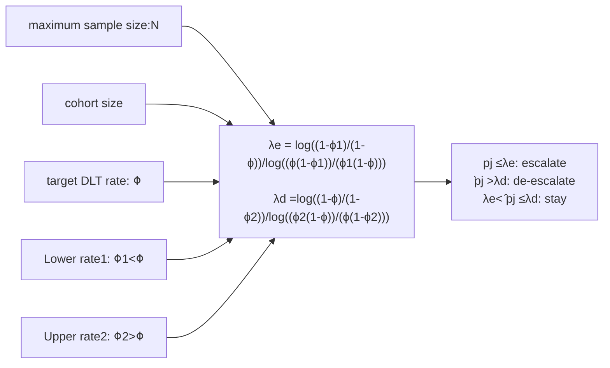

```mermaid
flowchart LR
A[maximum sample size:N]
B[cohort size]
C["target DLT rate: 𐌘"]
D["Lower rate1: 𐌘1<𐌘"]
E["Upper rate2: 𐌘2>𐌘"]

O["λe = log((1-ϕ1)/(1-ϕ))/log((ϕ(1-ϕ1))/(ϕ1(1-ϕ)))<br>
λd =log((1-ϕ)/(1-ϕ2))/log((ϕ2(1-ϕ))/(ϕ(1-ϕ2)))"]
R["pj ≤λe: escalate<br>̂pj >λd: de-escalate<br>λe< ̂pj ≤λd: stay"]

A -->O
B -->O
C -->O
D -->O
E -->O

O --> R

```