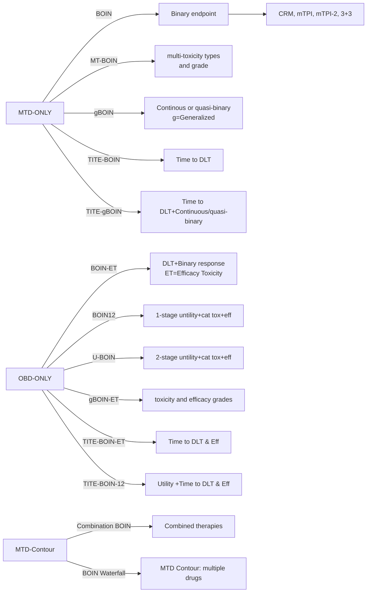

```mermaid
flowchart LR

A[MTD-ONLY]
B[OBD-ONLY]
C[MTD-Contour]

A1[Binary endpoint]
A2["multi-toxicity types <br> and grade"]
A3["Continous or quasi-binary<br>g=Generalized"]
A4[Time to DLT]
A5[Time to DLT+Continuous/quasi-binary]

A11[CRM, mTPI, mTPI-2, 3+3]

A --> |BOIN| A1 --> A11
A --> |MT-BOIN| A2
A --> |gBOIN| A3
A --> |TITE-BOIN| A4
A --> |TITE-gBOIN| A5

B1["DLT+Binary response<br>ET=Efficacy Toxicity"]
B2[1-stage untility+cat tox+eff]
B3[2-stage untility+cat tox+eff]
B4[toxicity and efficacy grades]
B5[Time to DLT & Eff]
B6[Utility +Time to DLT & Eff]

B -->|BOIN-ET| B1
B -->|BOIN12| B2
B -->|U-BOIN| B3
B -->|gBOIN-ET| B4
B -->|TITE-BOIN-ET| B5
B -->|TITE-BOIN-12| B6

C1[Combined therapies]
C2[MTD Contour: multiple drugs]

C -->|Combination BOIN| C1
C -->|BOIN Waterfall| C2

```