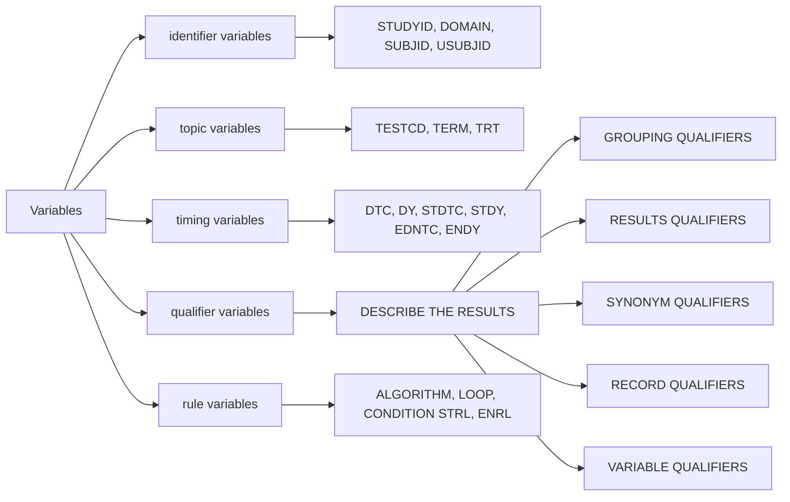

```mermaid
flowchart LR
    A["Variables"]
    B1["identifier variables"]
    B2["topic variables"]
    B3["timing variables"]
    B4["qualifier variables"]
    B5["rule variables"]

    C1["STUDYID, DOMAIN, SUBJID, USUBJID"]
    C2["TESTCD, TERM, TRT"]
    C3["DTC, DY, STDTC, STDY, EDNTC, ENDY"]
    C4["DESCRIBE THE RESULTS"]
    C5["ALGORITHM, LOOP, CONDITION STRL, ENRL"]

    Q1["GROUPING QUALIFIERS"]
    Q2["RESULTS QUALIFIERS"]
    Q3["SYNONYM QUALIFIERS"]
    Q4["RECORD QUALIFIERS"]
    Q5["VARIABLE QUALIFIERS"]

    A --> B1 --> C1
    A --> B2 --> C2
    A --> B3 --> C3
    A --> B4 --> C4
    A --> B5 --> C5

    C4 --> Q1
    C4 --> Q2
    C4 --> Q3
    C4 --> Q4
    C4 --> Q5

```